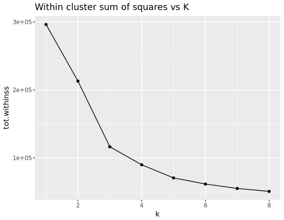

#Prerequisites
```{r, eval=FALSE}
#Prereqs
install.packages(c("caret",
  "ROCR",
  "broom",
  "feather",
  "biglm",
  "lubridate"))

#Prereqs from yesterday
install.packages(c(
  "tidyr",
  "knitr"))
```


```{r, message = FALSE, echo=FALSE}
library(readr)
library(knitr)
library(tidyr)
library(dplyr)
library(caret)
library(ROCR)
library(ggplot2)
library(broom)
library(feather)
library(biglm)
library(lubridate)

#file pathing:
#In the lab use: 
PRAC_HOME <- "/users/ugrad/amsi_705/MSBigData/Practicals/prac02"
#On your laptops use:
#library(here)
#PRAC_HOME <- here()
```


#Introduction
In this practical we give example applicatons of some the statistical modelling and analysis methods discussed in the overview lecture. The focus will be on interpreting the output and key metrics associated with model quality. We will not use big data frameworks for these methods just yet. We will when we drill into each type of method in the following sessions. This session is about getting a feel for the outputs associated with the methods.

## Logistic Regression
This example is built from [this H20 tutorial](http://blog.h2o.ai/2013/08/run-h2o-from-within-r/).

### Background
As revision or a breif introduction: In Logistic rergression we make a binary classification using a linear model of the form:

$$log\left(\frac{\pi_{i}}{1-\pi_{i}}\right) = x_{1,i}\beta_{1} + x_{2,i}\beta_{2} + ... + \epsilon_{i} $$ 
where $\pi_{i} = Pr(Y_{i} = 1|X_{i})$  and $Y_{i} \in [0,1]$. It's a binary classifier. 

The model is fit by using an iterative numerical method that estimates the $\hat{\beta}$ that maximise the likelihood of the data given the model. 

Now depending on our objective we may be intested in:

* Creating a parsimonious model that admits meaningful interpretation of $\hat{\beta}$
* Maximising the accuracy of predicting $Y_i$ 
    - Usually measure accuracy on 'out of sample' data.
    
**Discuss**

* Who has used Logistic Regression on real world data and what was the objective of the analysis?

### An R example

#### Init
```{r, message = FALSE}
#data
prostate_data <- read_csv(file.path(PRAC_HOME,"data/prostate.csv"))
```

#### Data
The example dataset relates to prostate cancer. The response is `CAPSULE`: 'penetration of prostatic capsule'. A binary indicator of interest in prostate cancer prognosis.

The other varibales relate to the spread of cancer in a prostage biopsy sample, rectal examination, and cancer marker levels in paient blood. See [./data/pros.txt](./data/pros.txt) for more information.

Each row contains:
```{r, messages = FALSE}
prostate_data[1:10,] %>% 
  kable()
```

**Discuss**: 

* For modelling CAPSULE for a given patient, is this data tidy?

#### Model Fit Output
Here we model CAPSULE as a simple linear combination of all covariates except GLEASON, without considering interactions.
```{r}

caps_model <- glm(prostate_data, 
                 formula = CAPSULE ~ AGE + RACE + DPROS + DCAPS + VOL + PSA,
                 family = binomial(link = "logit")
                 )
```

We can get some ouput using:
```{r}
summary(caps_model)
```
The output is composed of 

* **parameter estimates**, (the $\beta_{i}$ coefficients of $x_{i,j}$ ) and measures of their uncertainty.
* **measures of model quality**, the null and resiudal deviances, and AIC value.

**Discuss:**

* What interpretations do we have of these quantities?
* In what contets are these measures useful?
    - How relevant are they to Big Data applications?
    
#### Model Performance Measures
##### Confusion Matrix
```{r}
predicted_CAPSULE <- predict(caps_model,type='response')>=0.5
table(as.logical(prostate_data$CAPSULE), predicted_CAPSULE) %>%
  caret::confusionMatrix()
```
We have measures of: 

* **accuracy** and **precision**, Confusion Matrix, Accuracy, Sensitivity (true +), Specificity (true -)
* **relative performance**, No Information Rate, Kappa. 

##### ROC Analysis 
Receiver Operator Curves (ROC) are a common output diagnostic for binary classification models. Sometimes they will just be summarised by a single summary statistic: Area Under Curve (AUC).

Here are these summaries for out logistic regression model:

```{r, echo=FALSE}
library(ROCR)
pred_obj <- prediction(predict(caps_model,type='response'), prostate_data$CAPSULE)
perf_object <- performance(pred_obj, "tpr", "fpr")
auc_object <- performance(pred_obj, measure = "auc")
auc_score <- auc_object@y.values[[1]]

data.frame(false_positive_rate = perf_object@x.values[[1]], true_positive_rate = perf_object@y.values[[1]]) %>%
  ggplot(aes(x = false_positive_rate, y = true_positive_rate)) +
    geom_line() +
    geom_abline(slope = 1, intercept = 0) +
    ggtitle("ROC Curve for CAPSULE Logistic Regression Model", sprintf("AUC=%1.4f",auc_score) )  
```

**Discuss:**

* What is the interpretation of the ROC and AUC?
* Have you seen this used before?

#### Exercise 
A [GLEASON score](https://en.wikipedia.org/wiki/Gleason_grading_system) is given to prostate tissue biopsies after examination by pathologists. It measures rate of incidence of certain types of cancer cells. Comment on change in classification performance and model quality after fitting a new logistic regression with `GLEASON` included. If you are confident with R, plot two ROC curves, one for each model, to aid comparisson.

#### Scaling Up
The state of the art in moden large scale logist regression is to find the optimal parameters using stochastic gradient descent. See http://www.win-vector.com/blog/2010/12/large-data-logistic-regression-with-example-hadoop-code/ for example.

## Clustering
Keeping the same data set you're going to produce and analyse the output of K Means clustering. Make sure to drop `ID` from the dataset:
```{r}
prostate_cluster_data <- prostate_data %>% select(-ID)
```

### R Commands
`kmeans()` can be used to fit a K Means model. The main parameter of interest is `k`. Check the help file with `help(kmeans)` for other parameters, they can be left at defaults for this exercise.

You may find the functions `brooom::tidy()` and `broom::glance()` useful for tidying up the model fit output. For example `glance(cluster_model)` produces a small summary like:

```
     totss tot.withinss betweenss iter
1 296289.4     189853.6  106435.8    1
```

Commonly cluster quality is assessed by comparing the **within cluster sum of squares** (WSS), **between cluster sum of squares** (BSS), and the **total sum of squares** (TSS).

WSS decreases naturally with increasing K. A plot of WSS vs K is often used to identify where the point where increasing K provides little utility. E.g:



**Discuss:**

* Why aren't high numbers of clusters desirable?
* How would the plot and SS metrics be useful to decide number of clusters?
    - What other ways could K be chosen? We'll discuss this further in a future lecture.

### Exercise
Choose the best K from the range 2:8 for a K Means clustering model for the prostate data set. You will need to use either a loop, `lapply`, or `map` function to fit 7 cluster models. Try to produce Then examine the cluster centres to see if you can make a characterisation of each cluster. 

## Principal Component Analysis (PCA)
In this section we're going to examine the outputs associated with PCA on the prostate cancer patients.

Use the same dataset from K Means.

### R commands

A PCA can be created using the `prcomp()` command. 

If we're using PCA for dimension reduction, the primary question with PCA is how many components to caputre enough variation in the data (commponly called *proportion of variance explained*).  The variation caputred along each prinicpal component axis can be visualised with `plot(pca_model)`. `summary()` is likewise useful for this.

You can get access to the dataset represented along the PCs in `prcmp_model$x, you could also use `predict()` for this.

### Exercise
Creata a PCA for the prostate data set. Do not include the response variable, `CAPSULE` in the PCA.

Use the output to select an appropriate number of PCs. Plot the data reprented along PC1 and PC2 and overlay the `CAPSULE` label.

## Linear Regression
As a contiuation of yesterdays's prac, fit a linear model to the M4 data to predict travel time. 

### R commands
Some filtering of NA (missing) values will be necessary. If would like to intoduce lagged features, you may not want to get rid of the NA rows until after the feature engineering is complete. The command `na.omit()` maybe be useful. `filter()` is also an option.

Use `dplyr::mutate` in combination with `lubridate::hour()` and other time functions from `lubridate` to generate the same feautres we did yesterday in SparkR.

R has a version of `lm` for large datasets called `biglm()` this is the method you can use today. The syntax is very similar to `glm()` from logistic regression above.

The dataset from yesterday is compressed an a lightweight `feather` (.ftr) format to read it, first uncompress the `./data/m4_data.ftr.zip` into the `./data/` folder and then use `feather::read_feather(file.path(PRAC_HOME,"data/m4_data.ftr"))`.

**Discuss:**

* What are the main model performance and quality measures of linear models?
* What conclusions can you draw from the results?


